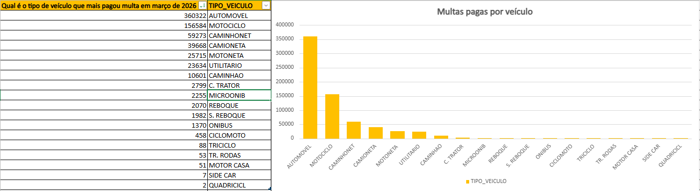

# Aula 06 — Tratamento de Dados 1

### Sobre a atividade

Tratamento de dados em planilha para responder perguntas específicas.

---

### Análises realizadas

#### Quantidade de multas pagas em SJC

Utilização da função `SOMASE` para somar os valores conforme critério definido.

---

#### Tipo de veículo com mais multas em março de 2026

Aplicação da função `SOMASE` para identificar o tipo de veículo com maior quantidade de multas.

