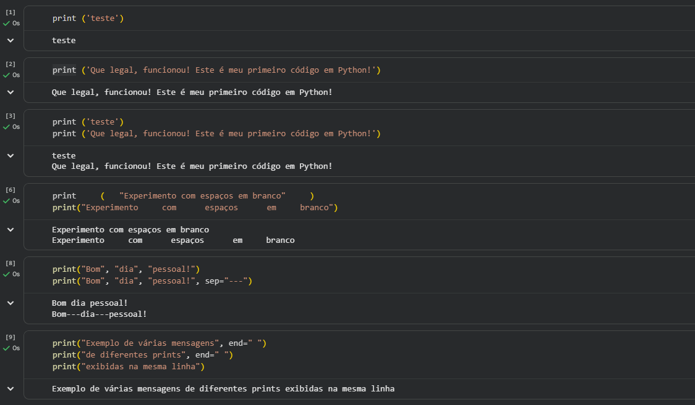
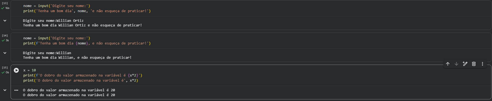
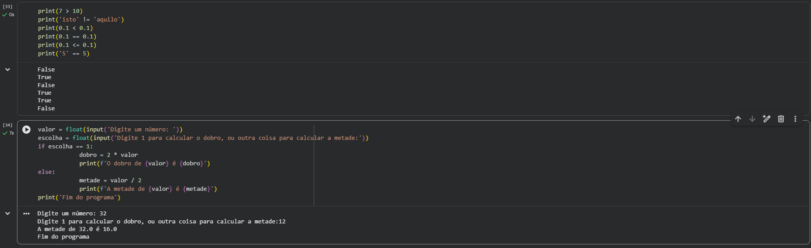
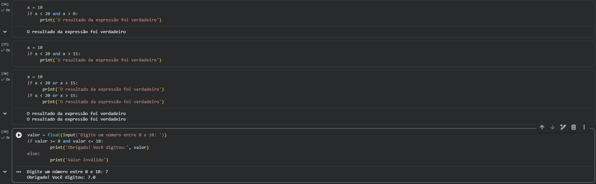

# Curso — Python Fundamental 1

### Sobre o curso

Curso introdutório de Python com foco nos fundamentos da programação e no desenvolvimento da lógica computacional.

---

## Conteúdo

### Módulo 01 — Introdução à Programação e à Linguagem Python

Introdução aos conceitos básicos de programação e à linguagem Python.

Uso inicial da função `print` para exibir informações.

#### Exemplo de prática

---

### Módulo 02 — Dados e Operadores

Introdução aos tipos de dados e operações básicas em Python.

---

#### Literais e Tipos de Dados

Apresentação dos principais tipos de dados.

---

#### Expressões Matemáticas

Uso de operadores para realizar cálculos.

### Módulo 03 — Variáveis e Interação com o Usuário

Criação de variáveis e interação com o usuário.

---

#### Variáveis e Tipos de Dados

Definição de variáveis e uso de diferentes tipos.

---

#### Entrada de Dados e Conversão

Leitura de dados do usuário e conversão entre tipos.

---

#### Conversão de Tipos e Arredondamentos

Conversão entre diferentes tipos de dados e aplicação de arredondamentos em valores numéricos.

### Módulo 04 — Estruturas Condicionais

Introdução ao uso de condições em programas Python.

---

#### Operadores Relacionais e Condições

Uso de operadores para comparar valores e criar condições.

---

#### Operadores Lógicos

Aplicação de operadores lógicos para combinar condições.

---

## Aprendizados
- Estrutura básica da linguagem Python
- Manipulação de variáveis e dados
- Uso de operadores e condições
- Interação com o usuário

---

## Certificado

