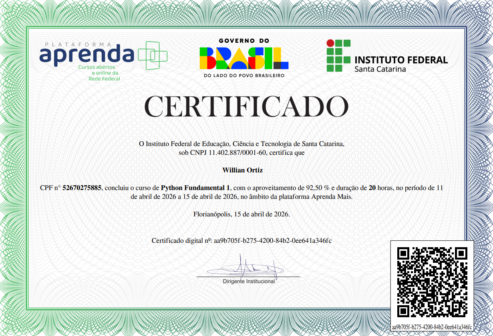

# Curso — Python Fundamental 1

### Sobre o curso

Curso introdutório de Python com foco nos fundamentos da programação e no desenvolvimento da lógica computacional.

---

## Conteúdo

### Módulo 01 — Introdução à Programação e à Linguagem Python

Apresentação dos conceitos iniciais de programação e introdução à linguagem Python, com foco na compreensão da estrutura básica de um programa.

Ao final do módulo, foram realizados testes práticos utilizando a função `print` para exibição de informações.

#### Exemplo de prática

---

### Módulo 02

### Módulo 03

### Módulo 04

---

## Aprendizados

* Fundamentos da lógica de programação
* Estrutura básica da linguagem Python
* Manipulação de dados e variáveis
* Uso de condicionais para controle de fluxo

---

## Certificado

